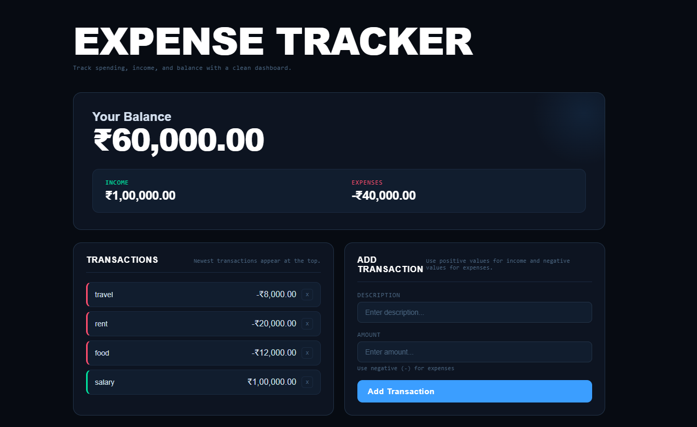

# 💰 Expense Tracker Web App

A modern and minimal **Expense Tracker application** built using **HTML, CSS, and JavaScript** to manage income, expenses, and overall balance with a clean dashboard UI.

---

## 🚀 Overview

This project helps users track their financial activity in real-time. It provides a clear breakdown of **total balance, income, and expenses**, along with a dynamic transaction history.

The application focuses on **DOM manipulation, event handling, and persistent data using Local Storage**, making it both functional and practical.

---

## ✨ Features

* 💵 Real-time balance calculation
* 📈 Separate tracking of income and expenses
* ➕ Add new transactions (income/expense)
* 🗑️ Delete transactions instantly
* 📜 Transaction history with latest entries on top
* 💾 Data stored using Local Storage (no data loss on refresh)
* 🌙 Clean dark-themed UI for better user experience

---

## 🛠️ Tech Stack

* **HTML** – Structure
* **CSS** – Styling (Modern dark UI)
* **JavaScript** – Logic and interactivity
* **Local Storage** – Data persistence

---

## 📂 Project Structure

```id="y91t8p"
Expense-Tracker/
│
├── index.html
├── style.css
├── script.js
└── final-look/
    └── web-page.png
```

---

## ⚙️ How to Run the Project

1. Clone the repository:

```id="m3k8qp"
git clone <your-repo-link>
```

2. Open the folder:

```id="r2c7kx"
cd Expense-Tracker
```

3. Run the project:

* Open `index.html` in your browser

---

## 📸 Screenshot

<p align="center">
  
</p>

---

## 🎯 Key Highlights

* Clean dashboard layout inspired by modern finance apps
* Visual separation of income (green) and expenses (red)
* Smooth and responsive user interactions
* Persistent state management using browser storage

---

## 🎯 Learning Outcomes

Through this project, I strengthened my understanding of:

* DOM Manipulation
* Event Handling
* Managing application state
* Local Storage integration
* UI structuring and layout design

---

## 🔮 Future Improvements

* 📊 Add charts/graphs for better financial insights
* 📅 Add date-based filtering
* 🔍 Search and filter transactions
* 📱 Improve mobile responsiveness

---

## 🤝 Contributing

Contributions are welcome! Feel free to fork this repository and submit a pull request.


## 👨‍💻 Author

**Rajbir Singh**

---

⭐ If you like this project, consider giving it a star!
